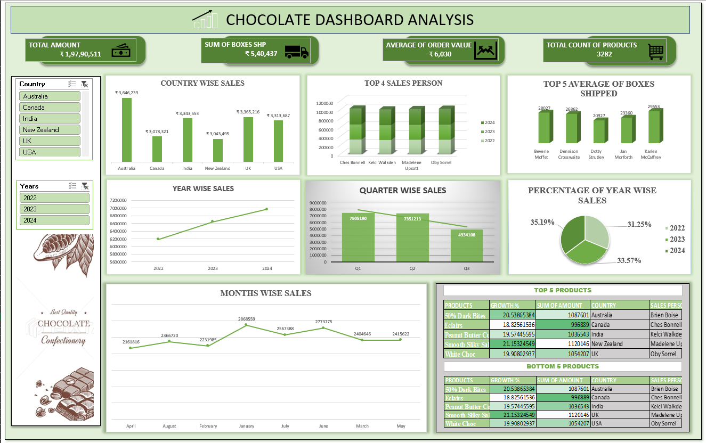
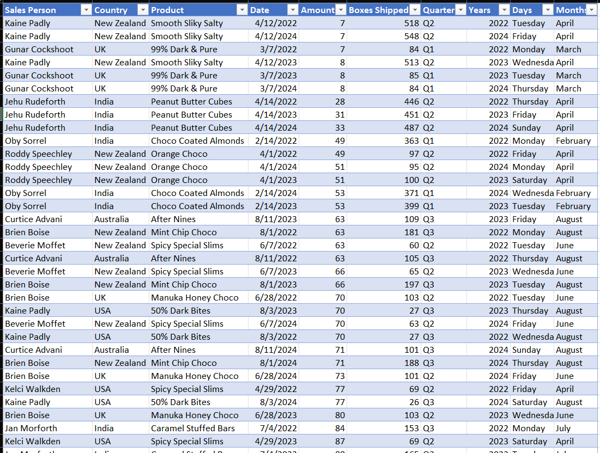

# Choco-dashboard-analysis
The Chocolate Sales Dashboard offers a comprehensive analysis of chocolate sales performance across various countries, years, quarters, months, sales personnel, and products.  It assists management in comprehending sales trends, recognizing high-performing products and employees, and evaluating performance over different time periods.
## Project Preview

## Project Overview

### What the project is
A dashboard for chocolate sales has been developed to assess and illustrate sales performance.
### What data or topic it covers
The data encompasses chocolate sales information, which includes sales amounts, the number of boxes shipped, product details, countries, sales representatives, years, quarters, and months.
### What users can explore or learn from it
Users have the ability to examine sales trends, performance by country, the best and worst performing products, the effectiveness of sales personnel, as well as annual and monthly sales patterns to gain insights into the overall performance of the business.

## From Data to Dashboard
The project commenced with a unstructured chocolate sales dataset that exhibited inconsistencies and gaps in data. Initially, I understook the task of cleaning the data, addressing missing values, standardizing the information, and incorporating new columns such as Quarter, Year, Day, and Month. Ultimately, I converted the cleaned data into a structured format on power query in excel and utilized it to develop an interactive dashboard in Excel.

### Source Data

## Dashboard Features
### KPI Cards
- Total Sales
- Total Profit
- Total Orders
- Total Customers
- Average Order Value
### Interactive Filters / Slicers
- Date / Year
- City
- Category
- Product
- Customer
### Charts & Visualizations
- Sales by month → Line chart
- Sales by category → Bar/Column chart
- Sales by city → Bar chart
- Top products → Bar chart
- Profit vs Sales → Combo chart
### Trend Analysis
- Monthly/Yearly sales trends
- Growth or decline
- Year-over-year comparison
### Top & Bottom Performers
- Top 5 products
- Top 5 customers
- Bottom-performing products
- Best-performing cities
### Drill-down / Detailed Table
- Allows users to see detailed records behind the summary.
### Conditional Formatting
- Highlight high/low sales
- Positive/negative growth
- Target achievement
### Dynamic Dashboard
- Charts and KPIs automatically change when filters/slicers are selected.
### Comparison
- Actual vs Target
- 2023 vs 2024
- Current month vs previous month
### Clean User Interface
- Clear title
- Consistent formatting
- Easy-to-read charts
- Logical layout
- Minimal unnecessary information

## Files Included

| File | Description |
|---|---|
| `your-dashboard.xlsx` | Completed Excel dashboard |
| `dashboard.png` | Preview of the final dashboard |
| `data.png` | Preview of the source data |
| `README.md` | Project documentation |

## How to Download and Use

1. Download `your-dashboard.xlsx`.
2. Open the workbook using Microsoft Excel.
3. Navigate to the dashboard worksheet.
4. Use the available filters and slicers to explore the results.

[Download the Excel Dashboard](your-dashboard.xlsx)

